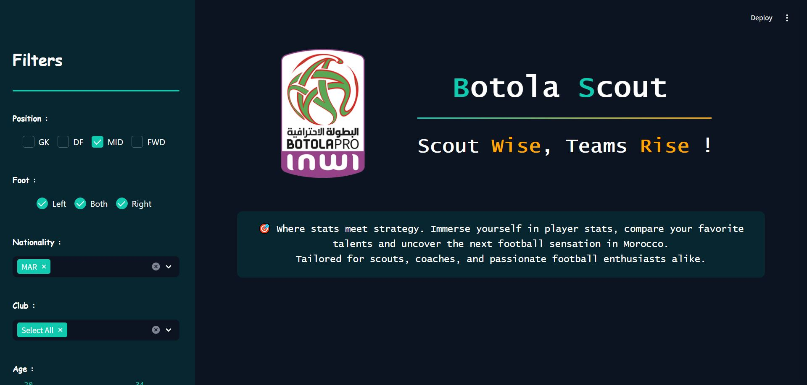

<div align="center">
  <h1 id="top" align="center"> ⚽ Botola Scout ⚽</h1></div>
  </a>
  
<h2 id="overview"> 🎯 Overview </h2>
Welcome to <b>BotolaScout</b>, an innovative web application tailored for scouting in the 2023/24 Botola Pro ! ! <br><br>

BotolaScout stands at the intersection of data science and sports, transforming how player performance is analyzed and understood in the Moroccan football premier league. By integrating advanced statistical analysis and interactive visualizations, this application harnesses the power of technology & data to offer in-depth player performance analyses, providing scouts, coaches, and passionate football enthusiasts with the tools they need to discover and evaluate the next football sensation.<br>
Dive into the world of Moroccan football like never before with BotolaScout – where data meets passion, and talent rises to the top !<br><br>

If you like the repo, please feel free to give it a ⭐ (top right).

<h2 id="key-features"> 🌟 Key Features</h2>
<b>  ●  Comprehensive Player Database:</b> Access detailed statistics and profiles for every player in the Botola Pro 2023/24 season.<br><br>
<b>  ●  Advanced Filtering System:</b>  Utilize a multi-parameter search engine to find players matching specific criteria.<br><br>
<b>  ●  Interactive Dashboards:</b> Visualize player performance through intuitive heat maps, shot maps, beeswarm plots and comparative radar and pizza charts.<br><br>
<b>  ●  Data-Driven Insights:</b> Make informed decisions with up-to-date statistics and performance metrics.<br><br>
<b>  ●  User-Friendly Interface:</b> Navigate effortlessly through player profiles, team statistics, and league-wide comparisons.<br><br>

<h2 id="technologies"> 🛠️ Technologies</h2>
<b>  ●  Data Collection:</b> Web & API scraping for gathering comprehensive and real-time player data from various sources (SofaScore & TransferMarket)<br><br>
<b>  ●  Backend:</b> Python,  the backbone of the application, used for data collection, processing, and backend logic with Streamlit<br><br>
<b>  ●  Frontend:</b> CSS & HTML for designing a sleek and user-friendly interface.<br><br>
<b>  ●  Visualization:</b> Interactive charts and graphs, implemented to display player statistics in a clear and engaging manner, enhancing the user experience.<br><br>

<h2 id="demo-usage"> 📍 Demo & Usage</h2>
To access the BotolaScout Web App online, go to :<br><br>
<li><a href="https://botola-scout.streamlit.app/">BOTOLA SCOUT</a></li> 
<br><br>If you prefer to run the app locally, follow these steps:<br><br>

1. **Clone the repository:**
    ```bash
    git clone https://github.com/MS3B09/Botola-Scout.git
    ```
2. **Navigate to the project directory:**
    ```bash
    cd Botola-Scout
    ```
3. **Install the required dependencies:**
    ```bash
    pip install -r requirements.txt
    ```
4. **Run the App:**
    ```bash
    streamlit run scouting_app.py
    ```
